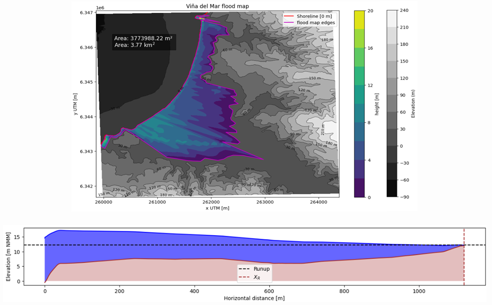

# Forward Energy Grade Line Analysis (FEGLA) for tsunami inundation mapping

This code proposes a simplified model for generating tsunami inundation maps using topo-bathymetric profiles and height wave on the shoreline.

## Table of Contents
- [Getting Started](#getting-started)
  - [Prerequisites](#prerequisites)
  - [Installing](#installing)
- [Deployment](#deployment)
- [Built With](#built-with)
- [Authors](#authors)
- [Acknowledgments](#acknowledgments)

## Getting Started

These instructions will get you a copy of the project up and running on your local machine for development and testing purposes.

### Prerequisites

What things you need to install the software and how to install them:

### Installing

A step by step series of examples that tell you how to get a development environment running:

Say what the step will be:

## Deployment

Add additional notes about how to deploy this on a live system.

## Built With

* [Dropwizard](http://www.dropwizard.io/1.0.2/docs/) - The web framework used
* [Maven](https://maven.apache.org/) - Dependency Management
* [ROME](https://rometools.github.io/rome/) - Used to generate RSS Feeds

## Authors

* **Francisco Sáez R.** - Assistant Researcher, CIGIDEN - [fj23eslaonda](https://github.com/fj23eslaonda)

## Acknowledgments

* [CIGIDEN](https://www.cigiden.cl/en/home/)

